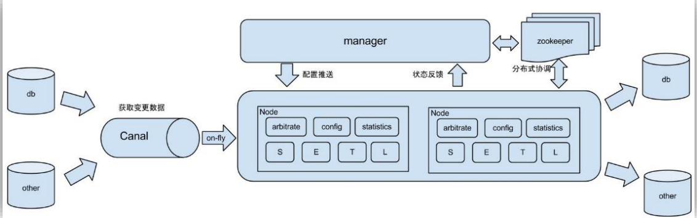
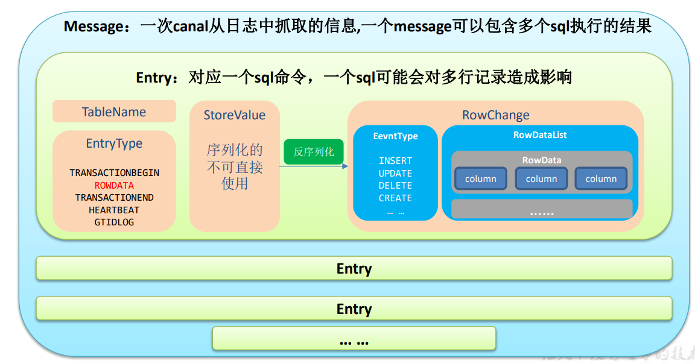

# 一、概述


## 简介

​      阿里巴巴 B2B 公司，因为业务的特性，卖家主要集中在国内，买家主要集中在国外，所 以衍生出了==同步杭州和美国异地机房的需求，==从 2010 年开始，阿里系公司开始逐步的尝试 基于数据库的日志解析，获取增量变更进行同步，由此衍生出了增量订阅&消费的业务。 Canal 是用 Java 开发的基于数据库增量日志解析，提供增量数据订阅&消费的中间件。 目前。==Canal 主要支持了 MySQL 的 Binlog 解析，解析完成后才利用 Canal Client 来处理获得 的相关数据。==（数据库同步需要阿里的 Otter 中间件，基于 Canal）。


## 工作原理

- **利用Mysql主从复制 [^见Maxwell]**


把自己伪装成 Slave，假装从 Master 复制数据。


## 使用场景


> 阿里 Otter 中间件的一部分





- 场景1 ：更新缓存

  


- 场景2   

  抓取业务表的新增变化数据，用于制作实时统计（我们就是这种场景）


# 二、安装部署


## 准备工作

```sh
#创建数据库gamll-2021

#创建数据表
CREATE TABLE user_info(
`id` VARCHAR(255),
`name` VARCHAR(255),
`sex` VARCHAR(255)
);


```


**🚩Mysql的Binlog配置与测试 见Maxwell**


```sql
#赋权
mysql>GRANT SELECT, REPLICATION SLAVE, REPLICATION CLIENT ON *.* TO 'canal'@'%' IDENTIFIED BY 'canal' ;
```


## 下载安装

[下载链接](https://github.com/alibaba/canal/releases)        ==canal.deployer-1.1.2.tar.gz==

```sh
#下载后上传到/opt/sortware  解压到 /opt/module/canal
🚩提前创建/opt/module/canal
$ tar -zxvf canal.deployer-1.1.2.tar.gz -C /opt/module/canal
```


## 修改配置


- **canal.properties**

  ```sh
  #在/opt/module/canal/conf
  
  👇修改如下内容
  #################################################
  ######### common argument ############# 
  #################################################
  
  # tcp, kafka, RocketMQ
  canal.serverMode = tcp
  
  #################################################
  ######### destinations ############# 
  #################################################
  canal.destinations = example
  
  ```

  

`canal.destinations = example`


==一个 canal 服务 中可以有多个 instance，conf/下的每一个 example文件 即是一个实例默认一个==


<!--如果需要多个实例处理不同的 MySQL 数据的话，直 接拷贝出多个 example，并对其重新命名，命名和配置文件中指定的名称一致，然后修改 canal.properties 中的 canal.destinations=实例 1，实例 2，实例 3。-->


- **instance.properties**

  ```sh
  #地址/opt/module/canal/conf/example
  
  #配置Mysql服务器地址
  
  #################################################
  ## mysql serverId , v1.0.26+ will autoGen 
  canal.instance.mysql.slaveId=20
  
  canal.instance.master.address=hadoop102:3306
  
  
  
  #配置连接 MySQL 的用户名和密码，默认就是我们前面授权的 canal
  # username/password
  canal.instance.dbUsername=canal
  canal.instance.dbPassword=canal
  ```

  


# 三、案例实操


`实时监控`

## TCP 模式测试


- **在idea创建 gmall-canal 项目**

- **配置pom**

  ```properties
      <dependencies>
          <dependency>
              <groupId>com.alibaba.otter</groupId>
              <artifactId>canal.client</artifactId>
              <version>1.1.2</version>
          </dependency>
          <dependency>
              <groupId>org.apache.kafka</groupId>
              <artifactId>kafka-clients</artifactId>
              <version>2.4.1</version>
          </dependency>
      </dependencies>
  ```

- **创建 com.atguigu.app 包创建 CanalClient**

  ```java
  public class CanalClient {
      public static void main(String[] args) throws InterruptedException, InvalidProtocolBufferException {
  
  
          //1 获取canal连接对象
          CanalConnector connector = CanalConnectors.newSingleConnector(
                  new InetSocketAddress("hadoop102", 11111), "example", "", "");
  
  
          while (true) {
              //2 获取连接
              connector.connect();
  
              //3 订阅数据库
              connector.subscribe("gmall-2021.*");
  
              //4 获取数据
              Message message = connector.get(100);
  
              //5 获取Entry集合
              List<CanalEntry.Entry> entries = message.getEntries();
  
              //6 判断是否有数据
              if (entries.size() <= 0) {
                  System.out.println("没有数据");
                  Thread.sleep(1000);
  
  
              } else {
                  //7 解析Entry
                  for (CanalEntry.Entry entry : entries) {
                      //7.1 获取表名
                      String tableName = entry.getHeader().getTableName();
  
                      //7.2 获取entry类型
  
                      CanalEntry.EntryType entryType = entry.getEntryType();
  
                      //7.3 获取序列化后数据
                      ByteString storeValue = entry.getStoreValue();
  
                      //7.4 判断当前entryType是否是ROWDATA
                      if (CanalEntry.EntryType.ROWDATA.equals(entryType)) {
  
                          //7.4.1 反序列化获取rowData
                          CanalEntry.RowChange rowChange = CanalEntry.RowChange.parseFrom(storeValue);
  
                          //7.4.2 获取事件的操作类型
                          CanalEntry.EventType eventType = rowChange.getEventType();
  
                          //7.4.3 获取数据集
                          List<CanalEntry.RowData> rowDatas = rowChange.getRowDatasList();
  
                          //7.4.4 遍历数据集，打印数据
                          for (CanalEntry.RowData rowData : rowDatas) {
  
                              // 更新前的数据
                              JSONObject beforeData = new JSONObject();
                              //遍历更新前的数据
                              rowData.getBeforeColumnsList().forEach(beforeColumn -> {
                                  beforeData.put(beforeColumn.getName(), beforeColumn.getValue());
                              });
  
  
                              // 更新后的数据
                              JSONObject afterData = new JSONObject();
                              //遍历更新后的数据
                              rowData.getAfterColumnsList().forEach(afterColumn -> {
                                  afterData.put(afterColumn.getName(), afterColumn.getValue());
                              });
  
                              //打印数据
                              System.out.println("tableName:" + tableName + " eventType:" + eventType + " beforeData:" + beforeData + " afterData:" + afterData);
                          }
  
  
                      } else {
                          System.out.println("当前entryType是" + entryType);
                      }
  
  
                  }
  
              }
  
  
          }
  
  
      }
  }
  
  
  
  ```

  


#### Canal数据结构





- 启动canal

  ```sh
  canal]$ bin/startup.sh
  ```

- 运行代码

- 向数据库gmall-2021/user_info做增删改操作

- 查看idea的控制台


## Kafka 模式


- 修改canal.properties        tcp，改为输出到 kafka

  ```properties
  #################################################
  ######### common argument ############# 
  #################################################
  canal.id = 1
  canal.ip =
  canal.port = 11111
  canal.metrics.pull.port = 11112
  canal.zkServers =
  # flush data to zk
  canal.zookeeper.flush.period = 1000
  canal.withoutNetty = false
  # tcp, kafka, RocketMQ
  canal.serverMode = kafka
  					👆
  # flush meta cursor/parse position to file
  
  ```

- 修改 Kafka 集群的地址

  ```properties
  ##################################################
  ######### MQ #############
  ##################################################
  canal.mq.servers = hadoop102:9092,hadoop103:9092,hadoop104:9092
  ```

- 修改 instance.properties 输出到 Kafka 的主题以及分区数

  ```properties
  # mq config
  canal.mq.topic=canal_test
  canal.mq.partitionsNum=1
  # hash partition config
  #canal.mq.partition=0
  #canal.mq.partitionHash=mytest.person:id,mytest.role:id
  ```

  

<!--注意：默认还是输出到指定 Kafka 主题的一个 kafka 分区，因为多个分区并行可能会打 乱 binlog 的顺序 ， 如 果 要 提 高 并 行 度 ， 首 先 设 置 kafka 的 分 区 数 >1, 然 后 设 置 canal.mq.partitionHash 属性-->


#### 测试

- 启动canal

  ```sh
  canal]$ bin/startup.sh
  ```

- 启动 Kafka 消费客户端

  ```sh
  bin/kafka-console-consumer.sh --bootstrap-server hadoop102:9092 --topic canal_test
  ```

- 向数据库gmall-2021/user_info做增删改操作

- 查看kafka消费者的控制台


